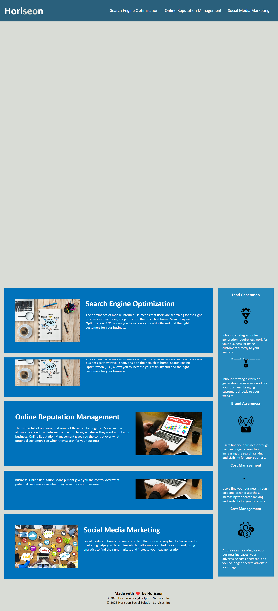

# Purgative-Stage

## Description
```

The goal is that the marketing agency's webpage meets accessibility standards, while following semantic structure and having logical and organized HTML & CSS files.
Knowledge of semantic structure elements was acquired while completing this webpage.
```

## Installation
```
The following image shows the web application's appearance and functionality:

Visit the live URL here: https://ceci-00.github.io/Purgative-Stage/
```
## Usage
```

```
## Credits
```
https://developer.mozilla.org/en-US/docs/Web/CSS

https://bootcampspot.instructure.com/courses/4828/pages

https://github.com/coding-boot-camp/urban-octo-telegram/tree/main/Develop

## License
```